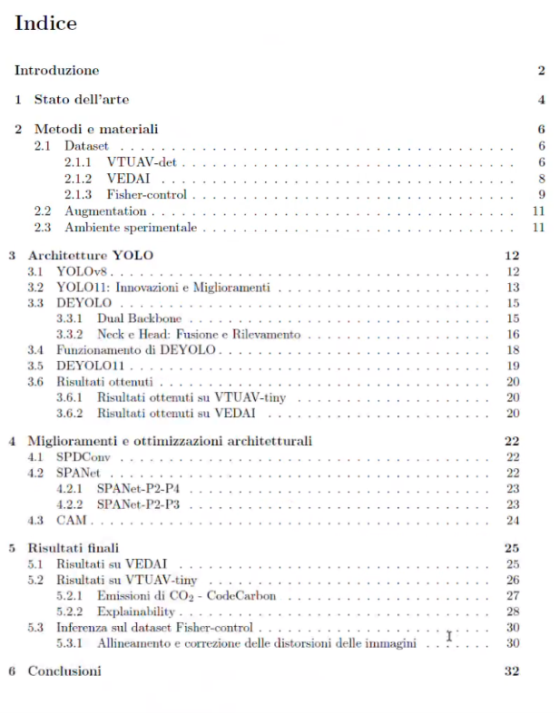

## Indice da seguire per la relazione del progetto

1. Introduzione (al problema)
2. Stato dell'arte (modelli esistenti e problemi che comportano che il progetto cerca di risolvere)
3. Strumenti e architetture
    - dataset (come è fatto, data augmentation?, tecniche utilizzate per train e test)
    - modelli (quali sono, cosa fanno)
4. Miglioramenti e ottimizzazioni architetturali
5. Risultati finali
6. Conclusioni
7. Possibili sviluppi futuri

8. BIBLIOGRAFIA

## Consigli
- SI all'usare l'ia ma porre attenzione a non usare caratteri tipici della generazione artificiale che non sono tipici del linguaggio naturale (punti e virgola, tratto orizzontale lungo, ...)