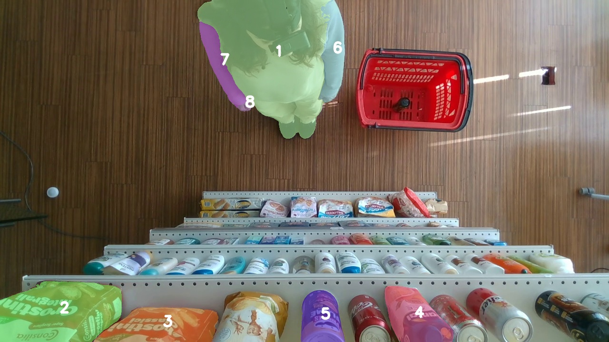
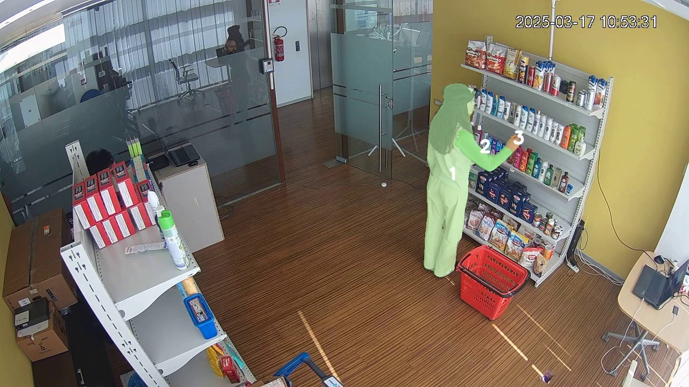
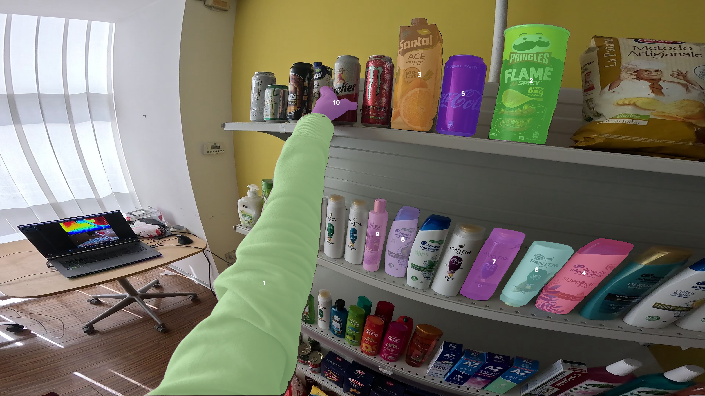

# PRIN Dataset VisualSync Pipeline
## PRIN dataset example

PRIN is a multi-view dataset captured from unsynchronized camera perspectives during object-interaction scenes. In this repository, each sequence is prepared from three views: an overhead **TOP** camera, a room-level **TPV** third-person camera, and an egocentric **FPV** first-person camera. The examples below show the three PRIN camera angles with tracked segmentation IDs overlaid.

<p align="center">
  
  
  
</p>

The merged synchronized result also combines the three views into a single visual check:

<p align="center">
  
</p>

This repository contains a working and minimal dataset spesific implementation on top of VisualSync paper. The goal is to synchronize three PRIN camera views:

```text
TOP  = overhead shelf view
TPV  = third-person room view
FPV  = first-person egocentric view
```

The current recommended strategy is to use TPV as the bridge camera:

```text
TOP ↔ TPV ↔ FPV
```

`TOP ↔ FPV` can be tested as a diagnostic pair, but it should not be forced into the global solution if it disagrees with the TPV bridge chain.

---

## 1. Minimal repository layout

The custom scripts are collected under `src/`:

```text
src/
├── prepare_prin_timecrop.py
├── create_tags.py
├── run_cotracker_all.py
├── img_match_v4.py
├── filter_corr_v2.py
├── shaowei_sync_v6.py
├── collect_sync_results.py
├── run_cotracker_v5.py
├── match_utils.py
└── job_sync_v6.py
```

The external dependencies remain in the repository as required by VisualSync, for example:

```text
Tracking-Anything-with-DEVA/
Grounded-SAM-2/
mast3r/
co-tracker/
preprocess/
```

Run all commands from the repository root:

```bash
git clone --recurse-submodules https://github.com/anilegin/visualsync.git
cd visualsync
```

---

## 2. Environment setup

Create and activate a virtual environment:

```bash
python3 -m venv vissync
source vissync/bin/activate
python -m pip install --upgrade pip
```

Install the main requirements:

```bash
pip install -r requirements.txt
```

Install the local/external packages used by the pipeline:

```bash
cd Tracking-Anything-with-DEVA
pip install -e .
cd ..

cd Grounded-SAM-2
pip install -e .
pip install --no-build-isolation -e grounding_dino
cd ..
```

Install VGGT from the official repository:

```bash
pip install -U "vggt@git+https://github.com/facebookresearch/vggt.git"
```

Download Model Weights
```bash
bash scripts/download_weights.sh
```
---

## 3. Global variables

Set these once per experiment:

```bash
export RAW_ROOT="/<your_path_to_dataset>/PRIN_DATASET/Video ed Excel"
export GROUP="ID_0"

export START_SEC=15
export END_SEC=30
export FPS=10

export DATA_ROOT="data/prin_${GROUP}_${START_SEC}_${END_SEC}"
export TRACK_ROOT="tracks/prin_${GROUP}_${START_SEC}_${END_SEC}"
export RESULT_ROOT="results/prin_${GROUP}_${START_SEC}_${END_SEC}"

export MASK_PREFIX="deva_improved"
```

Notes:

- `START_SEC` and `END_SEC` define the action-focused crop window.
- The output frame folders are named `rgb_aligned`.
- By default, `TOP` and `FPV` are horizontally flipped during extraction because this improved matching behavior in our tests.
- If a camera does not need flipping, remove it from `--flip_views`.

---

## 4. Prepare the cropped PRIN dataset

This step reads the original PRIN folder structure:

```text
$RAW_ROOT/
└── ID_0/
    ├── TOP/
    ├── TPV/
    └── FPV/
```

and creates:

```text
$DATA_ROOT/
├── ID_0_cam_top_000_150/rgb_aligned/
├── ID_0_cam_tpv_000_150/rgb_aligned/
└── ID_0_fpv_000_150/rgb_aligned/
```

Run:

```bash
python src/prepare_prin_timecrop.py --raw_root "$RAW_ROOT" --out_root "$DATA_ROOT" --group "$GROUP" --start_sec "$START_SEC" --end_sec "$END_SEC" --fps "$FPS" --flip_views TOP,FPV --overwrite
```

The script checks both `.mp4` and `.MP4`.

Check the output:

```bash
find "$DATA_ROOT" -maxdepth 2 -type d | sort
find "$DATA_ROOT" -path "*/rgb_aligned/*.jpg" | wc -l
```

---

## 5. Create GPT/SAM2 tag files

For the simplified pipeline, we ask the segmentation stage to focus on dynamic action regions:

```json
{
  "dynamic": [
    "hand",
    "arm"
  ]
}
```

Run:

```bash
python src/create_tags.py \
  --data_root "$DATA_ROOT" \
  --dynamic hand,arm \
  --overwrite
```

This creates:

```text
$DATA_ROOT/ID_0_cam_top_000_150/gpt_video/tags.json
$DATA_ROOT/ID_0_cam_tpv_000_150/gpt_video/tags.json
$DATA_ROOT/ID_0_fpv_000_150/gpt_video/tags.json
```

Check:

```bash
find "$DATA_ROOT" -path "*/gpt_video/tags.json" -type f -print -exec cat {} \;
```

---

## 6. Run SAM2 / GroundingDINO segmentation

Run the VisualSync segmentation step:

```bash
python preprocess/run_dino_sam2.py --workdir "$DATA_ROOT"
```

The terminal output should show which tags are being used. For this pipeline, it should use the `gpt_video/tags.json` files created in the previous step.

Check masks:

```bash
find "$DATA_ROOT" -path "*/$MASK_PREFIX/Annotations" -type d | sort
```

Expected folders:

```text
$DATA_ROOT/ID_0_cam_top_000_150/deva_improved/Annotations
$DATA_ROOT/ID_0_cam_tpv_000_150/deva_improved/Annotations
$DATA_ROOT/ID_0_fpv_000_150/deva_improved/Annotations
```

---

## 7. Run VGGT camera estimation

Run:

```bash
python preprocess/vggt_to_colmap.py \
  --workdir "$DATA_ROOT" \
  --vis_path vggt_output \
  --save_colmap
```

Check:

```bash
find "$DATA_ROOT" -path "*/vggt/*.npz" -type f | sort
```

Expected:

```text
camera_parameters.npz
```

Do not use `--vggt_choice full` unless `camera_parameters_full.npz` exists.

---

## 8. Run CoTracker

Use the SAM2 masks directly:

```bash
--mask_prefix "$MASK_PREFIX"
```

Run TOP and TPV with denser settings:

```bash
rm -rf "$TRACK_ROOT"
mkdir -p "$TRACK_ROOT"

python src/run_cotracker_all.py \
  --dataset_root "$DATA_ROOT" \
  --track_root "$TRACK_ROOT" \
  --gpu 0 \
  --mask_prefix "$MASK_PREFIX" \
  --only static \
  --static_interval 3 \
  --static_grid_step 5 \
  --skip_exist
```

Run FPV more conservatively because it is much slower:

```bash
python src/run_cotracker_all.py \
  --dataset_root "$DATA_ROOT" \
  --track_root "$TRACK_ROOT" \
  --gpu 0 \
  --mask_prefix "$MASK_PREFIX" \
  --only fpv \
  --dynamic_interval 8 \
  --dynamic_grid_step 10 \
  --skip_exist
```

If FPV becomes too sparse, rerun only FPV with a denser setting:

```bash
python src/run_cotracker_all.py \
  --dataset_root "$DATA_ROOT" \
  --track_root "$TRACK_ROOT" \
  --gpu 0 \
  --mask_prefix "$MASK_PREFIX" \
  --only fpv \
  --dynamic_interval 5 \
  --dynamic_grid_step 8
```

Check:

```bash
find "$TRACK_ROOT" -name "tracks.pkl" | sort
```

Expected:

```text
$TRACK_ROOT/ID_0_cam_top_000_150/tracks.pkl
$TRACK_ROOT/ID_0_cam_tpv_000_150/tracks.pkl
$TRACK_ROOT/ID_0_fpv_000_150/tracks.pkl
```

---

## 9. Run MASt3R image matching

Create result root:

```bash
rm -rf "$RESULT_ROOT"
mkdir -p "$RESULT_ROOT/$GROUP"
```

### 9.1 TOP–TPV

```bash
CUDA_VISIBLE_DEVICES=0 python src/img_match_v4.py \
  --dataset_root "$DATA_ROOT" \
  --video1_name "${GROUP}_cam_top_000_150" \
  --video2_name "${GROUP}_cam_tpv_000_150" \
  --save_root "$RESULT_ROOT/$GROUP" \
  --mask_prefix "$MASK_PREFIX" \
  --interval 2 \
  --batch_size 16 \
  --filter_mask \
  --enable_blurry
```

### 9.2 TPV–FPV

```bash
CUDA_VISIBLE_DEVICES=0 python src/img_match_v4.py \
  --dataset_root "$DATA_ROOT" \
  --video1_name "${GROUP}_cam_tpv_000_150" \
  --video2_name "${GROUP}_fpv_000_150" \
  --save_root "$RESULT_ROOT/$GROUP" \
  --mask_prefix "$MASK_PREFIX" \
  --interval 3 \
  --batch_size 16 \
  --filter_mask \
  --enable_blurry
```

### 9.3 Optional TOP–FPV diagnostic

```bash
CUDA_VISIBLE_DEVICES=0 python src/img_match_v4.py \
  --dataset_root "$DATA_ROOT" \
  --video1_name "${GROUP}_cam_top_000_150" \
  --video2_name "${GROUP}_fpv_000_150" \
  --save_root "$RESULT_ROOT/$GROUP" \
  --mask_prefix "$MASK_PREFIX" \
  --interval 3 \
  --batch_size 16 \
  --filter_mask \
  --enable_blurry
```

---

## 10. Filter track correspondences

Use relaxed thresholds for action-specific masks:

```text
min_matches = 3
pixel_tol = 10
min_neighbors = 1
```

### 10.1 TOP–TPV

```bash
CUDA_VISIBLE_DEVICES=0 python src/filter_corr_v2.py \
  --dataset_root "$DATA_ROOT" \
  --result_root "$RESULT_ROOT" \
  --track_root "$TRACK_ROOT" \
  --result_name1 "${GROUP}_cam_top_000_150" \
  --result_name2 "${GROUP}_cam_tpv_000_150" \
  --group_prefix "$GROUP" \
  --mask_prefix "$MASK_PREFIX" \
  --min_matches 3 \
  --pixel_tol 10 \
  --min_neighbors 1 \
  --max_batch_size 4096
```

### 10.2 TPV–FPV

```bash
CUDA_VISIBLE_DEVICES=0 python src/filter_corr_v2.py \
  --dataset_root "$DATA_ROOT" \
  --result_root "$RESULT_ROOT" \
  --track_root "$TRACK_ROOT" \
  --result_name1 "${GROUP}_cam_tpv_000_150" \
  --result_name2 "${GROUP}_fpv_000_150" \
  --group_prefix "$GROUP" \
  --mask_prefix "$MASK_PREFIX" \
  --min_matches 3 \
  --pixel_tol 10 \
  --min_neighbors 1 \
  --max_batch_size 4096
```

### 10.3 Optional TOP–FPV

```bash
CUDA_VISIBLE_DEVICES=0 python src/filter_corr_v2.py \
  --dataset_root "$DATA_ROOT" \
  --result_root "$RESULT_ROOT" \
  --track_root "$TRACK_ROOT" \
  --result_name1 "${GROUP}_cam_top_000_150" \
  --result_name2 "${GROUP}_fpv_000_150" \
  --group_prefix "$GROUP" \
  --mask_prefix "$MASK_PREFIX" \
  --min_matches 3 \
  --pixel_tol 10 \
  --min_neighbors 1 \
  --max_batch_size 4096
```

Check outputs:

```bash
find "$RESULT_ROOT/$GROUP" -name "tracks_match_v2.npz" -exec ls -lh {} \;
```

---

## 11. Run VisualSync offset estimation

Use a constrained search range for cropped action windows:

```text
offset_range = 25
```

Large ranges can create false minima, especially with FPV.

### 11.1 TOP–TPV

```bash
CUDA_VISIBLE_DEVICES=0 python src/shaowei_sync_v6.py \
  --dataset_root "$DATA_ROOT" \
  --result_root "$RESULT_ROOT" \
  --video1_name "${GROUP}_cam_top_000_150" \
  --video2_name "${GROUP}_cam_tpv_000_150" \
  --offset_range 25 \
  --moving_threshold 0.5 \
  --pixel_threshold 4 \
  --max_batch_size 4096 \
  --max_N 30000 \
  --use_v2 \
  --use_vggt \
  --disable_gt
```

### 11.2 TPV–FPV

```bash
CUDA_VISIBLE_DEVICES=0 python src/shaowei_sync_v6.py \
  --dataset_root "$DATA_ROOT" \
  --result_root "$RESULT_ROOT" \
  --video1_name "${GROUP}_cam_tpv_000_150" \
  --video2_name "${GROUP}_fpv_000_150" \
  --offset_range 25 \
  --moving_threshold 0.5 \
  --pixel_threshold 4 \
  --max_batch_size 4096 \
  --max_N 30000 \
  --use_v2 \
  --use_vggt \
  --disable_gt
```

### 11.3 Optional TOP–FPV

```bash
CUDA_VISIBLE_DEVICES=0 python src/shaowei_sync_v6.py \
  --dataset_root "$DATA_ROOT" \
  --result_root "$RESULT_ROOT" \
  --video1_name "${GROUP}_cam_top_000_150" \
  --video2_name "${GROUP}_fpv_000_150" \
  --offset_range 25 \
  --moving_threshold 0.5 \
  --pixel_threshold 4 \
  --max_batch_size 4096 \
  --max_N 30000 \
  --use_v2 \
  --use_vggt \
  --disable_gt
```

---

## 12. Collect offsets and create merged video

Use the collector script to summarize pairwise candidates, estimate global offsets, and create a merged video:

```bash
python src/collect_sync_results.py \
  --dataset_root "$DATA_ROOT" \
  --result_root "$RESULT_ROOT" \
  --group_name "$GROUP" \
  --fps "$FPS" \
  --max_seconds $((END_SEC-START_SEC)) \
  --panel_height 480 \
  --ignore_pair "${GROUP}_cam_top_000_150__${GROUP}_fpv_000_150"
```

This creates:

```text
$RESULT_ROOT/pairwise_offsets.csv
$RESULT_ROOT/global_offsets.csv
$RESULT_ROOT/merged_videos/
```

Check:

```bash
cat "$RESULT_ROOT/pairwise_offsets.csv"
cat "$RESULT_ROOT/global_offsets.csv"
ls -lh "$RESULT_ROOT/merged_videos"
```

If the merged video appears sign-reversed, regenerate with:

```bash
python src/collect_sync_results.py \
  --dataset_root "$DATA_ROOT" \
  --result_root "$RESULT_ROOT" \
  --group_name "$GROUP" \
  --fps "$FPS" \
  --max_seconds $((END_SEC-START_SEC)) \
  --panel_height 480 \
  --offset_sign -1 \
  --out_video_dir "$RESULT_ROOT/merged_videos_flip" \
  --ignore_pair "${GROUP}_cam_top_000_150__${GROUP}_fpv_000_150"
```

---

## 13. Recommended interpretation

The most stable graph is usually:

```text
TOP ↔ TPV ↔ FPV
```

Use these pairs for global alignment:

```text
TOP–TPV
TPV–FPV
```

Use `TOP–FPV` only as a diagnostic. If `TOP–FPV` disagrees with the chain, ignore it.

---

## 14. Runtime notes

FPV tracking is the slowest part.

Start with:

```text
dynamic_interval = 8
dynamic_grid_step = 10
```

If TPV–FPV becomes too sparse, rerun only FPV with:

```text
dynamic_interval = 5
dynamic_grid_step = 8
```

Avoid very dense FPV tracking unless needed, because it can take a long time even on an A6000.

---

## 15. Troubleshooting

### `pred_offset=None`

This does not always mean failure. Check the top candidate offsets in the result output or in `pairwise_offsets.csv`.

If candidates form a clean basin, for example:

```text
-6, -5, -7, -4
```

the fallback minimum may still be useful.

### Larger `offset_range` gives worse results

This is common with FPV. A larger range can introduce false minima. Use cropped action windows and local refinement:

```text
offset_range = 25
```

### Too many matches on static products

The segmentation is too broad. Use hand/arm-only tags or stricter masks.

### Matcher prefers head/body

The mask includes too much of the person. For synchronization, the active hand/arm region is usually more informative than the full body.

### TOP–FPV remains unreliable

Use TPV as bridge:

```text
TOP ↔ TPV ↔ FPV
```

Do not force TOP–FPV into the global graph.


